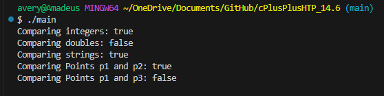

# cPlusPlusHTP_14.6

Write a simple function template isEqualTo that compares its two arguments with the equality operator == and returns true if they are equal and false otherwise. Use this function template in a program that calls isEqualTo only with a user-defined class type that overloads the equality operator. What happens when you try to call the function template with a user-defined class type that does not overload the equality operator?

# commands
compile
g++ main.cpp -o main -static

run
./main
